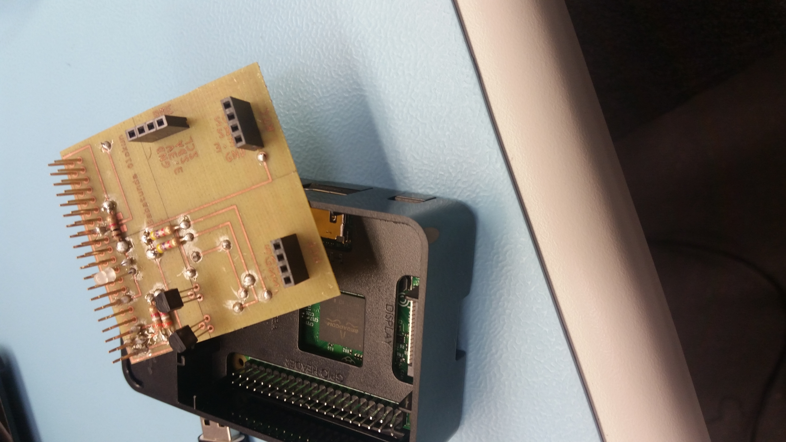

<ARTICLE ID="Article_1">
	<body background="Background.jpg">

 <HEADER ID="Header_Article_1">
  <H2>Building IoT Projects</H2>
 </HEADER>

 <SECTION ID="Section_0">
  <H3>Week 0 2017-2018 Capstone Project Overview</H3>
 </SECTION>
  
 <SECTION ID="Section_7">
  <H3>Week 7 Hardware (A - Monday Dec. 4, B - Friday Dec. 1)</H3>
  
 </SECTION>
  <SECTION ID="Section_6">
  <H3>Week 6 Hardware (A - Monday Nov. 27, B - Friday Nov. 24)</H3>
  
 </SECTION>
  <SECTION ID="Section_5">
  <H3>Week 5 Hardware (A - Monday Nov. 27, B - Friday Oct. 13)</H3>
	
  
 </SECTION>
 <SECTION ID="Section_4">
	<H3>Week 4 Hardware (A - Monday Oct. 2, B - Friday Sept. 29) </H3>
	

		https://github.com/neotech101/Voice-Recog/blob/master/Bankaccount.xlsx
	

 
 </SECTION>
 <SECTION ID="Section_3">
  <H3>Week 3 Hardware (A - Monday Sept. 25, B - Friday Sept. 22)</H3>
	

		https://github.com/neotech101/Voice-Recog/blob/master/BabatundeOlokun.mpp
	

 
 </SECTION>
 <SECTION ID="Section_2">
  <H3>Week 2 Hardware  (A - Monday Sept. 18, B - Friday Sept. 15)</H3>
	

		https://github.com/neotech101/Voice-Recog/blob/master/Submission%20Date.docx
	

 
 </SECTION>
 <SECTION ID="Section_1">
  <H3>Week 1 Hardware (A - Monday Sept. 11, B - Friday Sept. 8)</H3>
	

		https://github.com/neotech101/Voice-Recog
	

  
 </SECTION>
 
 </ARTICLE>
